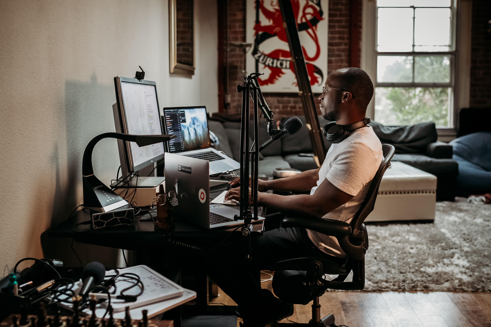

## My worldview is that the next generation of business owners will be internet-native hustlers.

More and more people turn to internet entrepreneurship, either as their full-time occupation or a side-hustle. These entrepreneurs come in many shapes and forms—from traditional brick-and-mortar-type shops building eCommerce stores to artists selling their art in the form of non-fungible tokens. They know how to make money on the internet; they run solo, have multiple income streams, and work with brands and partners across the globe.

One avenue of internet solopreneurship is the creator economy. “Creators” is often a catch-‘em-all term that refers to anyone from hobbyists selling PDFs on the side to professional vloggers on YouTube and the multitudes of ways to sell one’s work. Today, more than 50 million people worldwide consider themselves creators.

Despite the creator economy only being born a decade ago, it’s currently is estimated to be over 100 billion USD. Creators became the fastest-growing type of small business. A recent [study by Stripe](https://stripe.com/blog/creator-economy) shows a whopping 48% YoY growth in people turning to this type of solopreneurship since 2016. Today, different estimations exist around the number of active creators, however all in the range of 50-70 million unique individuals. 

These creators represent a market segment that is growing rapidly with unique, unseen before, needs. 

I'm excited about what's to come for these individuals.
